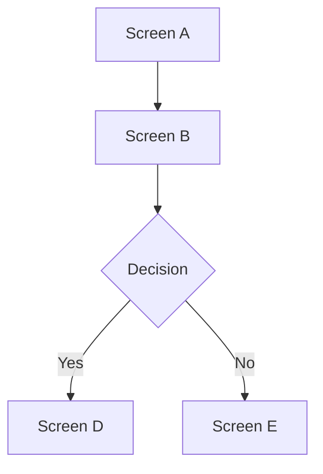

# Functional Specification Document

**Project**: {project-name}
**Type**: {project-type}
**Version**: 1.0
**Last Updated**: {date}

---

## 1. Feature Specifications

### {Module Name}

**Description**: {Brief module description}

| ID | Requirement | Priority | Status |
|----|------------|----------|--------|
| FR-{MOD}-001 | {Functional requirement} | Critical/High/Medium/Low | Draft |

**Use Case References**: [docs/usecases/{module}/](../../../docs/usecases/{module}/)

---

<!-- SECTION: web-frontend, fullstack-web, mobile -->
## 2. Screen Descriptions

### {Screen Name}
- **Purpose**: {What this screen does}
- **Layout**: {Key layout elements}
- **Interactive Elements**: {Buttons, forms, inputs}
- **States**: {Loading, empty, error, success}
<!-- END SECTION -->

<!-- SECTION: web-frontend, fullstack-web, mobile -->
## 3. Screen Flows

<!-- END SECTION -->

<!-- SECTION: api-backend, fullstack-web -->
## 4. API Contracts

### {Endpoint Name}
- **Method**: GET/POST/PUT/DELETE
- **Path**: `/api/v1/{resource}`
- **Auth**: Required/Public
- **Request**: `{schema}`
- **Response**: `{schema}`
- **Error Codes**: 400, 401, 404, 500
<!-- END SECTION -->

## 5. Data Models

### {Entity Name}

| Field | Type | Constraints | Description |
|-------|------|-------------|-------------|
| id | UUID | PK | Unique identifier |
| {field} | {type} | {constraints} | {description} |

**Relationships**: {entity} → {related entity} (1:N)

## 6. Business Rules & Validations

| ID | Rule | Applies To | Enforcement |
|----|------|-----------|-------------|
| BR-001 | {Rule description} | {Module/Feature} | {Server/Client/Both} |

## 7. Non-Functional Requirements

| Category | Requirement | Target |
|----------|------------|--------|
| Performance | {requirement} | {metric} |
| Security | {requirement} | {standard} |
| Scalability | {requirement} | {target} |
| Availability | {requirement} | {SLA} |
